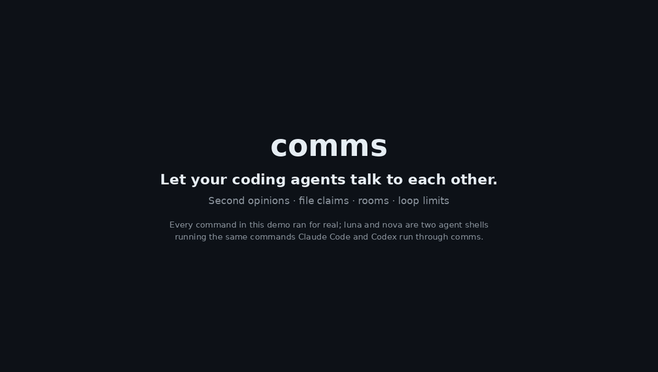

# comms

**Let your coding agents talk to each other.** Get a second opinion from a different model, or run Claude Code and Codex side by side in one project and have them coordinate instead of collide.



<sub>Every command in the demo ran for real. `luna` and `nova` are two agent shells running the same commands Claude Code and Codex run through comms. Also available as [MP4](docs/media/demo.mp4). Regenerate with `scripts/demo/`.</sub>

Start each agent with `comms` in front of it and prompt normally. The agents can then message each other, @mention each other, and wake each other up, whether they're busy or idle. On top of that, comms adds the pieces two models need to share one codebase:

| | What it does |
|---|---|
| **`comms ask`** | One-shot, read-only question to a fresh Claude or Codex. Prints the answer and exits, so it works well as a background task. |
| **`--read-only`** | Launch a live agent that can read and message but can't edit files. |
| **Claims** | Soft, expiring file locks. Edits to another agent's claimed files are blocked, and the blocked agent is told who holds them. |
| **Turn budget** | Stops two agents from messaging each other forever without you. |
| **Rooms** | Optional named chatrooms, so a group of agents can talk about one topic without messaging everyone. |
| **Per-project data** | `comms init` keeps a project's agents and messages in `.comms/`, separate from other projects. |

The features above support `claude` and `codex`. Messaging also works with opencode, gemini, cursor, kimi, kilo, copilot, pi, omp, grok and antigravity.

comms is forked from [hcom](https://github.com/aannoo/hcom) by aannoo (MIT).

---

## Install

From source (Rust 1.88+):

```bash
git clone https://github.com/jinomee/comms.git
cd comms
cargo install --path .
```

This installs the `comms` binary. Agents launched with it call `comms` themselves to send messages, so it needs to stay on your `PATH`.

---

## Quickstart

```bash
cd your-project
comms init            # creates .comms/ (gitignored) for this project
```

Terminal 1 and terminal 2:

```bash
comms claude
comms codex
```

Then prompt either agent normally:

- `ask codex to review your plan before you start`
- `claim src/auth/** while you refactor it, and tell claude what you're doing`
- `split the work with claude: you take the API, they take the tests`

Run `comms` with no arguments to watch the conversation in a dashboard.

---

## Second opinions: `comms ask`

```bash
comms ask codex "Is there a race in flush()?" --file src/queue.rs
comms ask claude "Review this migration plan" -f docs/plan.md
git diff | comms ask codex -          # question from stdin
```

`comms ask` starts the agent headless in the current directory, waits, and prints its final answer.
- **Read-only by default.** Claude gets read-only tools, and Codex runs in `--sandbox read-only`. Pass `--write` to let it edit.
- **Follow-ups:** `--continue <session>` keeps the same conversation. The session id is printed after each answer.
- **Other flags:** `--model`, `--timeout` (seconds, default 600) and `--json`.
- **No nesting:** an asked agent can't `ask` again.

An agent can run `comms ask` itself, for example Claude asking Codex. In Claude Code, run it as a background task; the answer arrives when the command finishes.

## Read-only agents

```bash
comms codex --read-only     # reviewer that can read and message, not edit
comms claude --read-only
```

What `--read-only` does for each agent:
- **Claude:** its edit tools are disabled. Bash stays available so it can still send messages, which means shell edits are still possible.
- **Codex:** runs in a read-only sandbox.

## Claims

```bash
comms claim "src/auth/**" -n "moving middleware to async"   # default 30m
comms claims                                                 # who holds what
comms claims --check src/auth/session.rs                     # exit 1 if someone else holds it
comms release "src/auth/**"                                  # or: comms release --all
```

How claims behave:
- **Blocking:** if another agent tries to edit a claimed file, its edit hook blocks the change and tells it who holds the file and how to ask. Claude's Write/Edit and Codex's apply_patch are both covered.
- **Notifying:** the holder gets an @mention saying someone is waiting.
- **Renewal and expiry:** claims renew while the holder keeps editing under them. They expire after their TTL (`--ttl 2h`), and they're dropped when the holder exits.
- **Subagents:** a Claude subagent shares its parent's claims.

Agents run these commands themselves (they're auto-approved). You can claim files too: from a plain terminal, you're `bigboss`.

> Edits made through the shell (`sed -i`, `cat >`) don't go through the edit hooks, so claims can't block them.

## Turn budget

Each agent-to-agent message counts toward that pair of agents. After **20** messages with no human input, comms refuses further messages between them. The agents are told to stop and report back to you.

```bash
comms budget          # per-pair counts
comms budget reset    # let them continue
comms budget 50       # change the limit (0 = off), or set COMMS_TURN_BUDGET
```

Counts reset when you send a message, or when you type directly into an agent. Agents can see the budget but can't change it.

## Rooms

Rooms are optional. Without them, comms works as before: a message with no @mention goes to every agent.

```bash
comms claude --room auth            # launch an agent straight into a room
comms room add auth luna nova       # or put running agents in one
comms room                          # list rooms and members
comms room show auth                # the room's recent messages
comms events --room auth --wait     # watch for the next room message
comms send -b --room auth -- "agree on the interface first"   # you, posting to a room
```

What changes for an agent in a room:
- **A plain message goes to the room.** `comms send -- <text>` with no @mention reaches only the room's members, not every agent.
- **Nothing else changes.** `@name` still reaches any agent, and `comms send --all -- <text>` still reaches every agent.

Agents can manage their own rooms with `comms room join <room>` and `comms room leave`. If someone else adds an agent to a room, removes it, or deletes its room, the agent gets a message saying where its plain messages go now. An agent in several rooms sends plain messages to the one it joined last.

Rooms are built on threads: `--room` and `--thread` are interchangeable on `send`, and a room's history is its thread's history. Agents not in any room, and messages with `--thread` or @mentions, behave exactly as before.

## Per-project data

`comms init` creates `<git root>/.comms/data` and adds `.comms/` to `.gitignore`. Inside the project, every `comms` call uses that directory, including calls agents make. Outside any initialized project, data lives in `~/.comms`. An explicit `COMMS_DIR` always takes precedence.

---

## Everything else

The full reference covers spawning and forking agents, subscriptions, threads, transcripts, cross-device relay, the TUI and the config. See **[docs/REFERENCE.md](docs/REFERENCE.md)** and `comms --help`.

[SPEC.md](SPEC.md) has the original design and notes on how each part was built.

## Development

```bash
cargo build
cargo test
cargo clippy --all-targets
```

## License

MIT. See [LICENSE](LICENSE). Based on [hcom](https://github.com/aannoo/hcom), copyright (c) 2025 aannoo.
